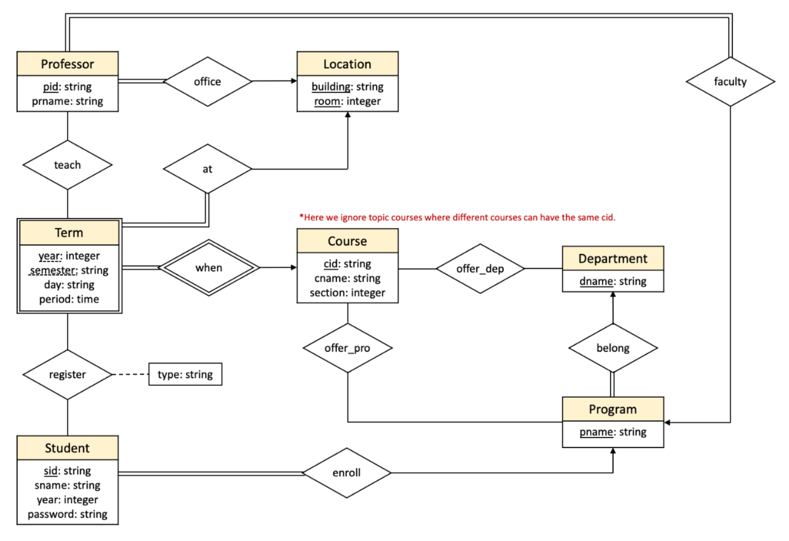

# Columbia Course Registration Platform

## Description

We built a database of the student course selection system, which aims to store information about students and courses, and allow students to use the system to query course rating, corresponding professor, credit, etc.

Due to the nature of our topic, our entities and relations are highly correlated, almost always forming a closed cycle between entities. This will be the top challenge for us when implementing the database for our application.

## Relational Database

